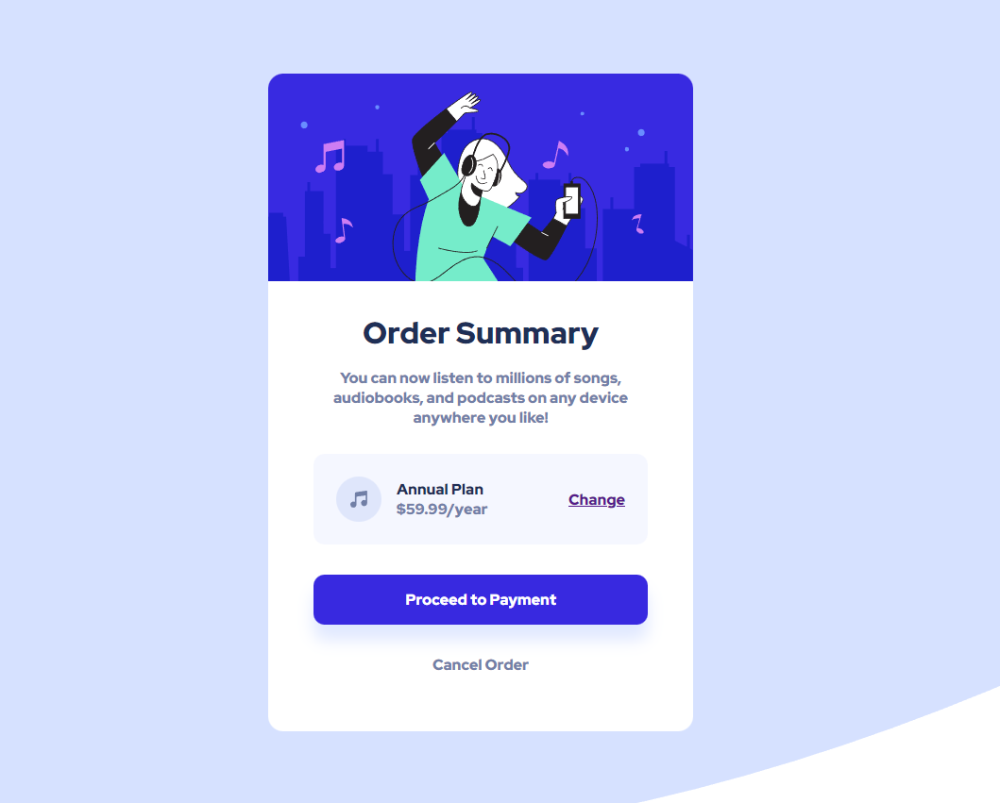
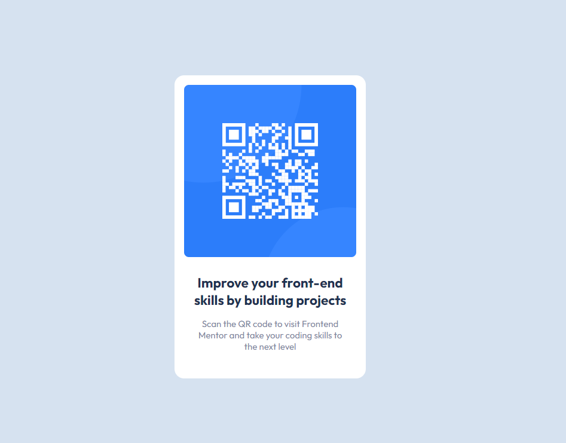
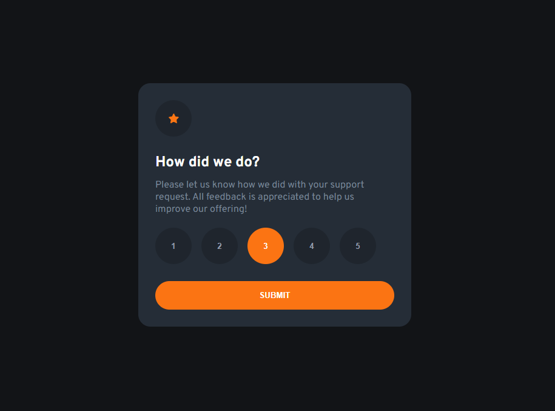
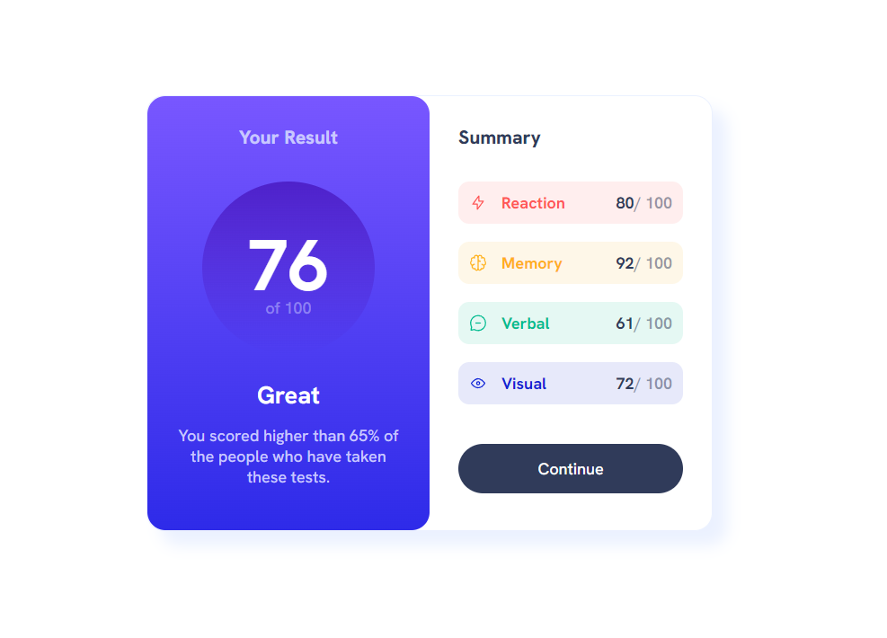
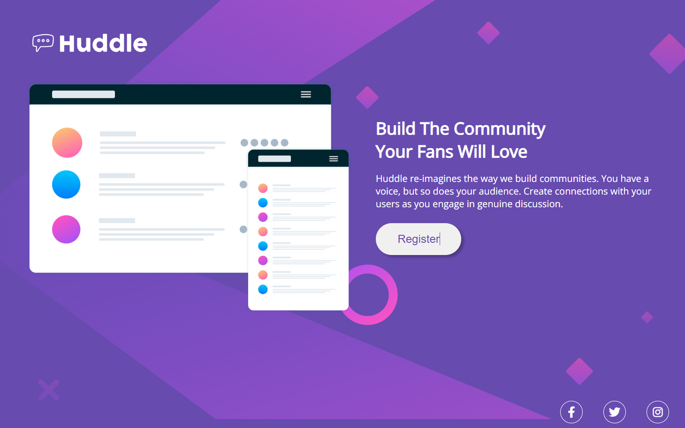
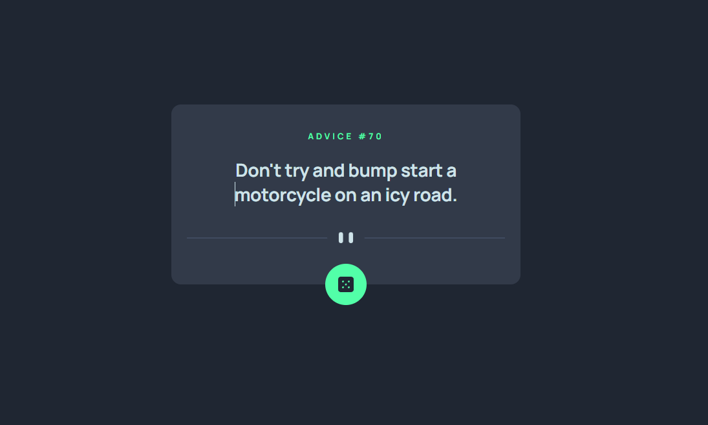
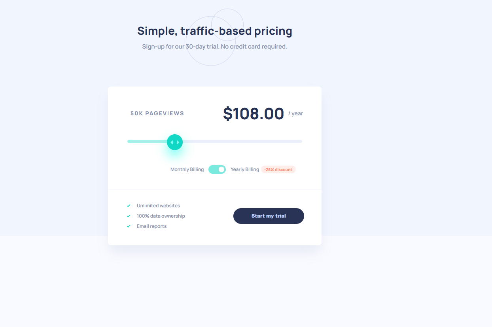
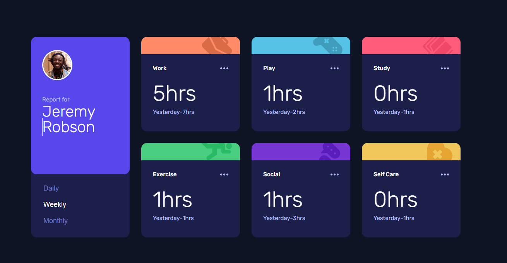
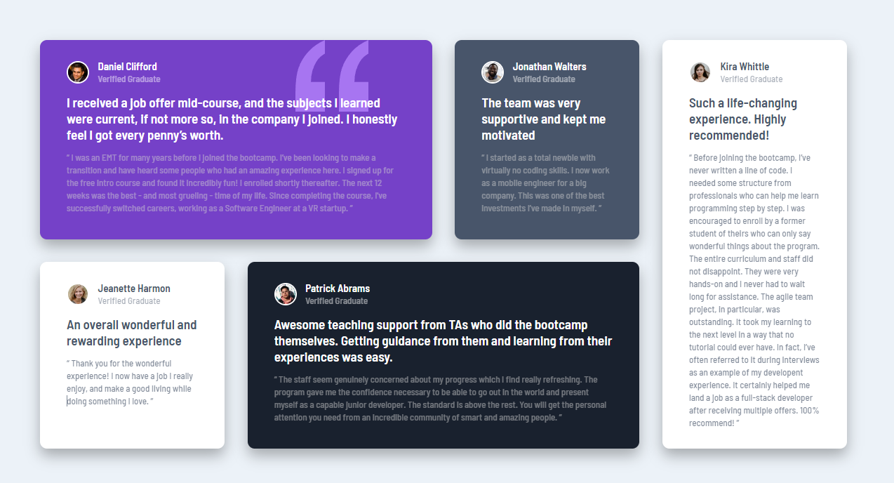

## What is inside?
Front-end Mentor website challenges list.
 
To view just click on the image of the challenge.
 
 
</img>
</img>
</img>

    <table>
    <thead>
        <tr>
            <th align="center">
                 
                
 
                    <small>
                        CHALLENGES
                    </small>
                

            </th>
            <th align="left">
                
                
 
                    <small>
                      TIER
                    </small>
                

            </th>
            <th align="center">
                
                
 
                    <small>
                      PREVIEW
                    </small>
                

            </th>
        </tr>
    </thead>
    <tbody>
        <tr>
            <td><a target=”_blank” rel=”noopener href="https://www.frontendmentor.io/challenges/order-summary-component-QlPmajDUj">Order summary component</a></td>
            <td align="center">NEWBIE</td>
            <td align="center">
            </td>
        </tr>
        <tr>
            <td><a target=”_blank” rel=”noopener href="https://www.frontendmentor.io/challenges/qr-code-component-iux_sIO_H">QR code component</a></td>
            <td align="center">NEWBIE</td>
            <td align="center"></td>
        </tr>
        <tr>
            <td><a href="https://www.frontendmentor.io/challenges/interactive-rating-component-koxpeBUmI">Interactive rating component</a></td>
            <td align="center">NEWBIE</td>
            <td align="center"></td>
        </tr>
        <tr>
            <td><a target=”_blank” rel=”noopener href="https://www.frontendmentor.io/challenges/results-summary-component-CE_K6s0maV">Results summary component</a></td>
            <td align="center">NEWBIE</td>
            <td align="center"></td>
        </tr>
        <tr>
            <td><a target=”_blank” rel=”noopener href="https://www.frontendmentor.io/challenges/huddle-landing-page-with-a-single-introductory-section-B_2Wvxgi0">Huddle landing page with a single introductory section
 </a></td>
            <td align="center">NEWBIE</td>
            <td align="center"></td>
        </tr>
        <tr>
            <td><a target=”_blank” rel=”noopener href="https://www.frontendmentor.io/challenges/advice-generator-app-QdUG-13db">Advice generator app</a></td>
            <td align="center">JUNIOR</td>
            <td align="center"></td>
        </tr>
         <tr>
            <td><a target=”_blank” rel=”noopener href="https://www.frontendmentor.io/challenges/interactive-pricing-component-t0m8PIyY8">Interactive pricing component
</a></td>
            <td align="center">JUNIOR</td>
            <td align="center">
            </td>
        </tr>
        <tr>
            <td><a target=”_blank” rel=”noopener href="https://www.frontendmentor.io/challenges/time-tracking-dashboard-UIQ7167Jw">Time tracking dashboard</a></td>
            <td align="center">JUNIOR</td>
            <td align="center">
            </td>
        </tr>
        <tr>
            <td><a target=”_blank” rel=”noopener href="https://www.frontendmentor.io/challenges/testimonials-grid-section-Nnw6J7Un7">Testimonials grid section</a></td>
            <td align="center">JUNIOR</td>
            <td align="center">
            </td>
        </tr>
    </tbody>
</table>

